# macOS Fleet Matrix

A production-oriented reference architecture for ephemeral Apple Silicon macOS CI runners using Tart, Packer, Ansible, GitHub Actions, Buildkite, Spinnaker, Prometheus, OpenTelemetry, and Grafana.

<p align="center">
  
</p>

<p align="center"><strong>QUEUE → LEASE → BOOT → BUILD → TEARDOWN → RECOVER</strong></p>

## Why this exists

macOS CI capacity is expensive and stateful by default. This project treats each runner as disposable infrastructure:

1. Build an immutable macOS/Xcode image.
2. Register capacity in a small inventory plane.
3. Lease a runner for exactly one job.
4. Execute the workload with a constrained identity.
5. Collect telemetry and lifecycle events.
6. Destroy or quarantine the VM after the job.
7. Replenish capacity from the known-good image.

The repository is intentionally useful on a laptop in simulation mode while preserving clear seams for a real Apple Silicon fleet.

## Current capabilities

What exists in this repository today, versus what the architecture below is designed to grow into:

- **Control-plane CLI (Python, `src/mfm/`)** — an in-memory inventory and lease model (`mfm inventory sample`, `mfm lease acquire`, `mfm lease release`). Runs in simulation mode only; there is no adapter that boots a real Tart VM yet.
- **Host telemetry probe (Swift, `src/mfm/Telemetry/`)** — reads live thermal state and memory/swap pressure straight from the Mach host port and BSD sysctl tree. See [Host telemetry probe](#host-telemetry-probe-swift) below. It reports host health; it is not yet wired into the scheduler.
- **Lease reaper (Rust, `src/mfm/Reaper/`)** — enforces the "fail closed" rule against an inventory snapshot: any leased runner past its `lease_expires_at` is quarantined. See [Lease reaper](#lease-reaper-rust) below. It operates on the same JSON shape the Python CLI emits; nothing yet pipes live inventory into it on a schedule.
- **Multi-cloud control-plane infrastructure (Terraform + Terragrunt, `terraform/control-plane/`)** — one reusable Terraform module per provider (AWS, GCP, Azure, OpenStack, AliCloud) under `modules/`, each orchestrated by a Terragrunt stack under `live/` that stands up a single host running the published control-plane container. `terraform validate`/`fmt` run against every module and `terragrunt validate` runs against every live stack in CI; none have been applied against a live account from this repository. See [`terraform/control-plane/README.md`](terraform/control-plane/README.md) for the module/live split and scope.
- **Continuous deployment (ArgoCD, `deploy/argocd/`, `deploy/k8s/control-plane/`)** — a real ArgoCD `Application` manifest and a Kustomize-built CronJob that runs the published control-plane image's smoke check on a schedule, the Kubernetes-native equivalent of what the cloud-init templates above do on a VM. Validated with `kubeconform` in CI. See [`deploy/argocd/README.md`](deploy/argocd/README.md) for scope — no live cluster is synced from this repository.
- **Docs and CI** — the architecture animation, threat model, and operations runbook are real documents, tested and lint-checked on every push. The container release workflow publishes the Linux control-plane image to GHCR.

Everything else in the architecture diagram — image baking, Spinnaker promotion, the Ansible host role — is a documented design, not yet exercised end-to-end by CI. The Kubernetes/ArgoCD manifests are the exception: they're schema-validated in CI (see above), just never applied to a live cluster.

## Architecture

```text
GitHub Actions / Buildkite
          |
          v
     Fleet API / CLI -----> Inventory + leases
          |                         |
          v                         v
      Tart runner <----------- health controller
          |
          +---- OpenTelemetry ----> Prometheus/Grafana
          |
          +---- lifecycle events -> audit log

Image pipeline:
Packer -> macOS/Xcode image -> signed artifact -> Tart import -> immutable pool

Promotion:
image -> Spinnaker canary -> bake/health gate -> blue/green fleet

Host configuration:
Ansible -> launchd / Tart prerequisites / observability agent
```

## Repository layout

- `src/mfm/` small Python control-plane library and CLI
- `src/mfm/Telemetry/` Swift host telemetry probe (thermal state, memory/swap)
- `src/mfm/Reaper/` Rust lease reaper (fail-closed lease TTL enforcement)
- `tests/mfmTests/` XCTest suite for the telemetry probe (alongside the existing pytest suite — macOS's default case-insensitive filesystem treats `Tests/` and `tests/` as the same directory, so both live under the lowercase name)
- `Package.swift` Swift package manifest for the telemetry module
- `packer/` image-build contract and validation scripts
- `ansible/` host bootstrap and hardening role
- `deploy/SPINNAKER.md` promotion contract for the macOS/Xcode image pipeline (a different tier — see `terraform/variables.tf` and `packer/`)
- `terraform/control-plane/modules/` reusable per-provider Terraform modules for the Linux control-plane host (AWS, GCP, Azure, OpenStack, AliCloud)
- `terraform/control-plane/live/` Terragrunt stacks that call those modules, one per provider
- `deploy/k8s/control-plane/` Kustomize manifests for the control-plane CronJob
- `deploy/argocd/` ArgoCD `Application` manifest for continuous deployment of those manifests
- `observability/` Prometheus and Grafana configuration
- `.github/workflows/` lint, test, policy, and GHCR release workflows
- `Dockerfile` multi-stage Linux container for the control plane
- `docs/` operational runbooks, threat model, and visual architecture mapping
- `docs/assets/` self-contained documentation graphics

## Quick start

Requires Python 3.11+.

```bash
python -m venv .venv
source .venv/bin/activate
pip install -e '.[dev]'
pytest
mfm inventory sample
mfm lease acquire --runner m1-01 --job demo-123
mfm lease release --runner m1-01 --job demo-123 --result success
```

Simulation is the default. Real Tart execution is an explicit adapter boundary and should only be enabled on an Apple Silicon host with the required tooling and entitlements.

## Lease reaper (Rust)

Requires Rust 1.75+ (stable channel).

```bash
cd src/mfm/Reaper
cargo test
mfm inventory sample | cargo run --quiet
```

`mfm-reaper` reads a fleet inventory snapshot as JSON — the same shape `mfm inventory` prints — and applies one rule: a runner in the `leased` state whose `lease_expires_at` is at or before the current time is quarantined, its job and lease fields cleared. Every other state passes through unchanged. This is the "fail closed" design principle from below expressed as a small, independently testable unit, in a second language on purpose: the Python model owns the state machine, the Rust binary only enforces one invariant against a snapshot of it. It is not yet wired into a scheduler loop — running it today means piping a snapshot into it by hand or from a script.

## Host telemetry probe (Swift)

Requires macOS 13+ on Apple Silicon and Swift 5.9+.

```bash
swift build
swift test
```

`HostTelemetryProbe.sample()` returns a `HostHealthState`: thermal state from `ProcessInfo.thermalState`, and memory/swap pressure read via `host_statistics64(HOST_VM_INFO64)` and `sysctlbyname("vm.swapusage")` — the same kernel counters `vm_stat` and Activity Monitor read, without forking a process and parsing its text output. The struct is `Codable`; `HostHealthState.jsonData()` gives a stable, ISO 8601-timestamped JSON snapshot.

This is a standalone probe today. It is not yet called by the scheduler, exported as Prometheus metrics, or used to gate lease acquisition — see [Roadmap](#roadmap).

## Container image

The Docker image packages the **Linux control plane only**. It does not virtualize macOS and does not replace the Apple Silicon Tart host layer.

```bash
docker build --pull --tag mfm:dev .
docker run --rm mfm:dev inventory sample
```

The image uses a multi-stage build, an explicit Python package build backend, a minimal Debian runtime, a non-root UID, bytecode compilation, OCI metadata, and a `.dockerignore`. CI builds and smoke-tests the image on every push and pull request.

Release images are published to GHCR from the GitHub release workflow with version tags and provenance attestations. GitHub's Container Registry supports provenance attestations and recommends associating the package with the repository through the `org.opencontainers.image.source` label. citeturn0search2turn0search5

## Architecture animation

The hero SVG is part of the repository and is tested in CI. It maps the visual states directly to control-plane lifecycle states rather than presenting an unrelated decorative diagram. It also includes a reduced-motion mode for accessibility.

See [`docs/ARCHITECTURE-ANIMATION.md`](docs/ARCHITECTURE-ANIMATION.md) for the state-by-state mapping.

## Design principles

### Ephemeral by default
A runner is leased to one job and then destroyed. Reuse is an exceptional, quarantined path rather than the normal lifecycle.

### Public repository, private credentials
This repository contains no cloud credentials, runner registration tokens, signing keys, or production endpoints. Workload credentials should be short-lived and injected by the CI platform.

### Fail closed
A runner that misses a heartbeat, reports an unhealthy guest, or exceeds its lease is removed from scheduling before recovery begins.

### Canary before capacity
New images enter a canary pool first. Only a healthy canary cohort can replace the current green fleet.

### Claims are measured, not assumed
Performance, cost, reliability, and recovery targets in this project are explicit hypotheses until backed by fleet telemetry.

## Security model

Public pull requests are untrusted workloads. The runner broker must not give a pull-request job host credentials, signing keys, persistent developer credentials, or unrestricted access to the management network. Prefer GitHub OIDC or Buildkite-issued short-lived identity for cloud access. Separate build identities from fleet-management identities.

The real deployment should also enforce network egress policy, artifact allowlists, image provenance verification, macOS privacy permissions, audit logging, and secret rotation outside this repository.

The container release workflow grants only `contents: read`, `packages: write`, `attestations: write`, and `id-token: write`, and uses immutable action references. GitHub documents `GITHUB_TOKEN` authentication for GHCR and recommends artifact attestations for container provenance. citeturn0search2

## Operational targets

These are targets for validation, not historical claims:

| Metric | Target | Measurement |
| --- | --- | --- |
| Runner acquisition | < 30 s at warm capacity | lease latency histogram |
| Job cleanup | < 60 s | destroy lifecycle timer |
| Image promotion | gated by canary health | promotion events |
| Stale runner rate | < 0.1% | unhealthy leases / total leases |
| Fleet recovery | automated | time-to-replenish |

## Roadmap

Not yet implemented — listed here so the architecture diagram above isn't mistaken for shipped functionality:

- **Virtualization.framework VM lifecycle** — no code boots, leases, or tears down a real VM. `mfm lease acquire` records state in memory only.
- **APFS copy-on-write image cloning** — the "immutable pool" step in the image pipeline is a documented contract in `packer/`, not exercised by any script.
- **Xcode/Simulator toolchain matrix switching** — no code touches `xcode-select` or CoreSimulator runtime state.
- **Telemetry-gated scheduling** — the host telemetry probe reports thermal/memory state but nothing yet reads it before assigning a job.
- **Prometheus/OpenTelemetry export** — `observability/prometheus.yml` is a scrape config target, not a running exporter.
- **Tart, Spinnaker (image promotion), and Ansible integration** — documented in `deploy/SPINNAKER.md` and `ansible/`, not yet driven by CI. This is separate from the ArgoCD/Kubernetes manifests below, which are validated in CI.
- **Scheduled reaping** — `mfm-reaper` is a correct, tested binary but nothing invokes it on a timer; there is no cron/systemd-timer/CronJob wiring it into a running fleet yet.
- **Live multi-cloud deployment** — the Terraform in `terraform/control-plane/` is validated in CI but has never been applied against a real AWS, GCP, Azure, OpenStack, or AliCloud account; there is no remote state backend or CI job authorized to run `terraform apply` or `terragrunt run --all apply`.
- **Live ArgoCD sync** — `deploy/argocd/application.yaml` is a real, validated manifest, but it has never been applied to a cluster from this repository; there is no cluster endpoint or credential here to sync against.

## License

MIT. See `LICENSE`.
